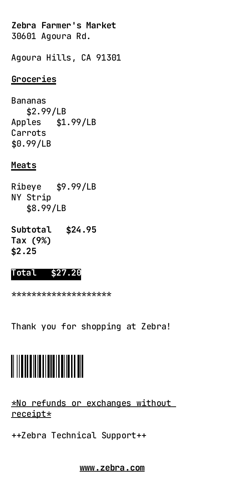
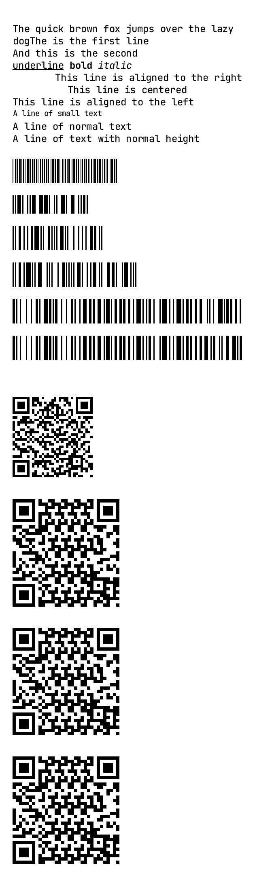
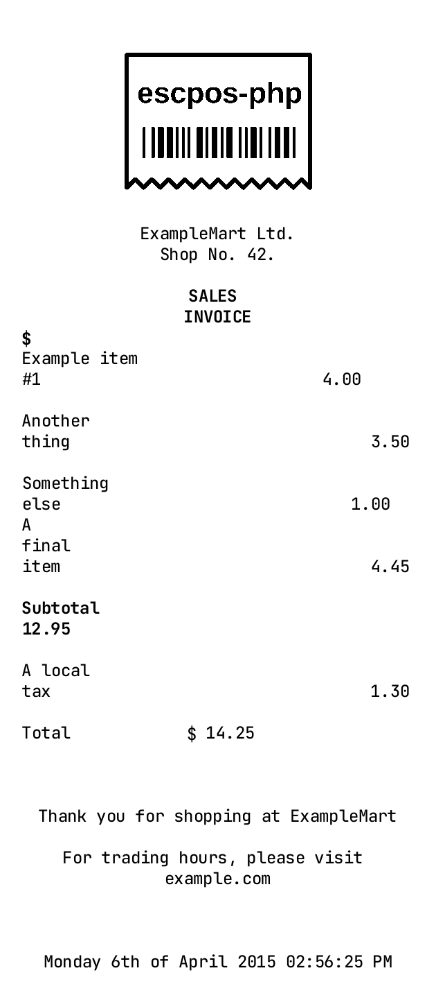

# Thermal
Thermal Emulator (esc/pos) being built in Rust.

This is my first Rust project, so things will be very messy. Feedback and contribution is welcome.

# Thermal Parser

Parse esc/pos commands from binary data. This crate is purely a parser and does not have any rendering code in it. See thermal_parser folder in the repo.

```rust

//See the resrouces/test folder for sample binary files
let bytes = std::fs::read("./thermal_test.bin".to_string()).unwrap();

//Create a context to store changes in text and graphic styles
let context = Context::new();

//Create a closure to handle parsed commands
let on_new_command = move |cmd: Command| {
    if debug { println!("{}", cmd.handler.debug(&cmd, &context)) };
};

//Create a new parser with the esc/pos command set
let mut command_parser = thermal_parser::new_esc_pos_parser(Box::from(on_new_command));

//Parse the bytes (Commands will be sent to the closure above)
command_parser.parse_bytes(&bytes);

```

# Thermal Renderer (Image)

Image rendering is mostly complete. There are some word wrapping issues and a couple of unimplemented features.

The image renderer uses a pretty basic and possibly inefficient hand rolled renderer that uses Fontdue for chatacter rasterization. Text layout is also hand rolled and still needs some work.

It currently supports Barcodes, QR Codes, Text formatting (bold, italic, underline, strikethough, invert, justification).

The image renderer implements the CommandRenderer trait. This allows you to implement a couple of commands (see next section) in order to roll your own renderer.

```rust

//See the resrouces/test folder for sample binary files
let bytes = std::fs::read("./thermal_test.bin".to_string()).unwrap();

//Create a context to store changes in text and graphic styles
let mut context = Context::new();

//Create the image renderer with a folder that you want to same images to
let mut image_renderer = ImageRenderer::new("./rendered_images".to_string());

//Create a closure to handle parsed commands
let on_new_command = move |cmd: Command| {
    //Pass the commands through to the renderer
    image_renderer.process_command(&mut context, &cmd);
};

//Create a new parser with the esc/pos command set
let mut command_parser = thermal_parser::new_esc_pos_parser(Box::from(on_new_command));

//Parse the bytes (Commands will be sent to the closure above)
command_parser.parse_bytes(&bytes);

```

### Here are some sample receipts that were rendered using the image renderer








# Roll Your Own Renderer

In order to roll your own renderer you just need to implement the CommandRenderer trait. The CommandRenderer abstracts out quite a bit of the logic needed to render out receipts.

The Context struct is extremely important here and provides graphics context along the way in addition to text styling context.

Have a look at the ImageRenderer under thermal_renderer/src/image_renderer/mod.rs for a better idea of how to create your own renderer.

```rust

struct MyOwnRenderer{}

impl CommandRenderer for MyOwnRenderer {
    //Create a receipt
    fn begin_render(&mut self, context: &mut Context){}
    
    //Begin a series of graphics commands (currently only draw_rect)
    fn begin_graphics(&mut self, context: &mut Context){}
    
    //Draw a rectangle
    fn draw_rect(&mut self, context: &mut Context, w: usize, h: usize){}
    
    //End a series of graphics commands
    fn end_graphics(&mut self, context: &mut Context){}

    //Draw an image. Bytes are u8 Luma values 0 = black 255 = white;
    fn draw_image(&mut self, context: &mut Context, bytes: Vec<u8>, width: usize, height: usize){}

    //Draw text
    fn draw_text(&mut self, context: &mut Context, text: String){}

    //Potentially render something for devices commands
    fn draw_device_command(&mut self, context: &mut Context, command: &DeviceCommand){}
    
    //Save out the receipt in whatever format the render saves out to
    fn end_render(&mut self, context: &mut Context){}
}

```


## Goals:
* Cover the whole esc/pos spec besides deprecated commands
* Provide a simple rendering pipeline that makes it easy to render in various formats
* Render to markdown
* Render to an image
* Render to HTML with SVG barcodes and QR Codes
* Allow for the creation of virtual USB and Ethernet printer emulators


## Fonts included in this repo do not fall under this repos licence

See thermal_render/resources/fonts/OFL.txt for the license. Fonts were obtained from JetBrains Mono repository on Github:
https://github.com/JetBrains/JetBrainsMono

## Inspiration/References:
https://github.com/receipt-print-hq/escpos-tools
https://github.com/local-group/rust-escposify
https://github.com/buntine/barcoders
https://reference.epson-biz.com/modules/ref_escpos/index.php?content_id=72
