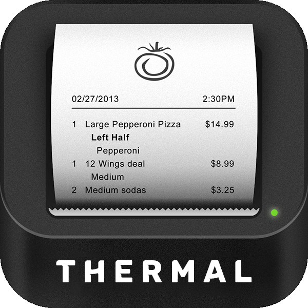
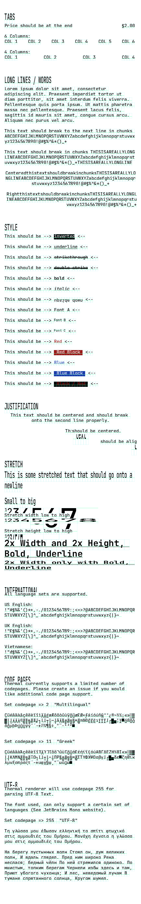
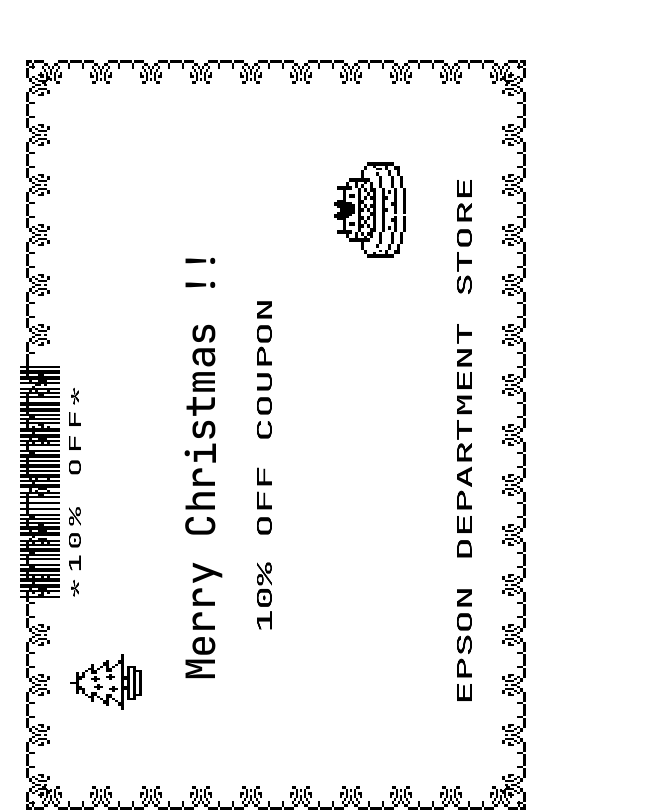
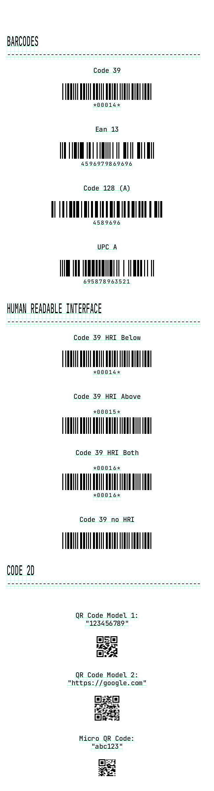

> [!WARNING]
> This project is not yet ready for production use but the api is mostly stable as of Oct 2024. Contributions and feedback are welcome.

# Receipt Renderer in Rust (ESC/POS) 


Thermal is a toolkit for parsing and rendering ESC/POS commands, capable of producing JPEG and HTML outputs.

Supports:

- Rendering to HTML and Images
- Human-readable format for commands (see docs)
- Page Mode
- Barcodes
- Qr Codes
- Some codepages (see docs)
- International

Plans

- Crate (We currently don't have a crate published but will publish soon when we feel that the library has sufficient tests.)
- WASM Library
- Playground
- CLI

[Read the docs](https://github.com/zachzurn/thermal/wiki)

TOC:

- [Image Rendering Example](#image-rendering)
- [Html Rendering Example](#html-rendering)
- [Thermal File Format](#thermal-file-format)
- [Sample Renders](#samples)

## Image Rendering

```rust
// Read string from thermal file
let text = read_to_string("hello_world.thermal");

//Parse into esc/pos commands
let bytes = parse_str( & text);

//Render to html
let renders = ImageRenderer::render(bytes);

// renders.output may contain multiple renders
// For this example we grab the first.
//
// Write the image to a file.
// Error handling is left out for brevity
if let Some(render) = renders.output.first() {
    save_image( & render.bytes, render.width, render.height, "hello_world.png");
}

// Error handling is left out for brevity
// png crate required for this example
fn save_image(bytes: &Vec<u8>, width: u32, height: u32, out_path: String) {
    let path = Path::new(&out_path);
    let file = File::create(path).unwrap();
    let ref mut writer = BufWriter::new(file);
    let mut encoder = png::Encoder::new(writer, width, height);

    encoder.set_color(png::ColorType::Grayscale);
    encoder.set_depth(BitDepth::Eight);

    let mut writer = encoder.write_header().unwrap();
    writer.write_image_data(bytes).unwrap();
}
```

## Html Rendering

```rust
// Read string from thermal file
let text = read_to_string("hello_world.thermal");

//Parse into esc/pos commands
let bytes = parse_str( & text);

//Render to html
let renders = HtmlRenderer::render(bytes);

// renders.output may contain multiple renders
// For this example we grab the first.
//
// Write the html to a file.
// Error handling is left out for brevity
if let Some(render) = renders.output.first() {
    let mut file = File::create("hello_world.html").unwrap();
    file.write_all(render.content.as_bytes());
}
```

## Thermal File Format:

This library supports raw binary, but also has support for a human readable format based on the programming examples
from the Epson website.

Example:

```
'// Initialize printer
    ESC "@"
    
'// Justify Center
    ESC "a" 1
    
'// Set font size to double 
    GS "!" 0x11
    
'// Print text
    "Hello World"
    
'// Select bit-image mode: 8-dot single-density, 48 byte column data
    ESC "*" 0 48 0
    0x00 0x00 0x00 0x00 0x00 0x00 0x00 0x00 0x07 0x07 0x09 0x09 0x7D 0x7C 0x10
    0x10 0x16 0x16 0x10 0x70 0xF8 0xFC 0x7E 0x3E 0x3E 0x7E 0xFE 0xFC 0x70 0x10
    0x16 0x16 0x10 0x10 0x7C 0x7D 0x09 0x09 0x07 0x07 0x00 0x00 0x00 0x00 0x00
    0x00 0x00 0x00    
 
'// --- Print barcode --->>>

'// Print and feed paper: Paper feeding amount = 4.94 mm (35/180 inches)
    ESC "J" 35

'// Set barcode height: in case TM-T20, 6.25 mm (50/203 inches)
    GS "h" 50

'// Select print position of HRI characters: Print position, below the barcode
    GS "H" 2

'// Select font for HRI characters: Font B
    GS "f" 1

'// Print barcode: (A) format, barcode system = CODE39
    GS "k" 4 "*00014*" 0


'// Select cut mode and cut paper
    GS "V" 66 30
   
    
```

## Samples

See the `sample_files` directory for more.

Typography:



Page Mode:



Barcodes and QR:



## Fonts

Font included in this repo do not fall under this repos licence.

See thermal_render/resources/fonts/OFL.txt for the license. Fonts were obtained from JetBrains Mono repository on
Github:
https://github.com/JetBrains/JetBrainsMono

## Inspiration/References:

- https://github.com/receipt-print-hq/escpos-tools
- https://github.com/local-group/rust-escposify
- https://github.com/buntine/barcoders
- https://reference.epson-biz.com/modules/ref_escpos/index.php?content_id=72
